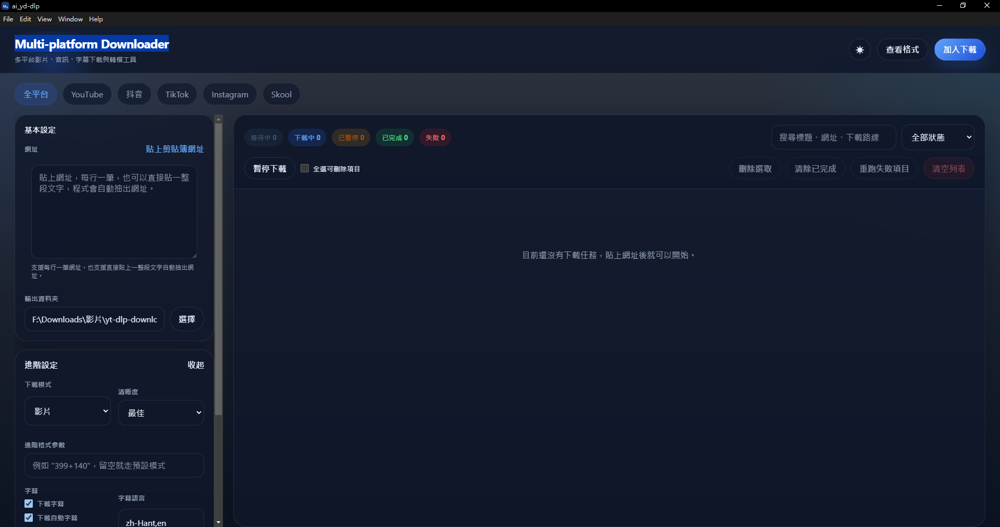
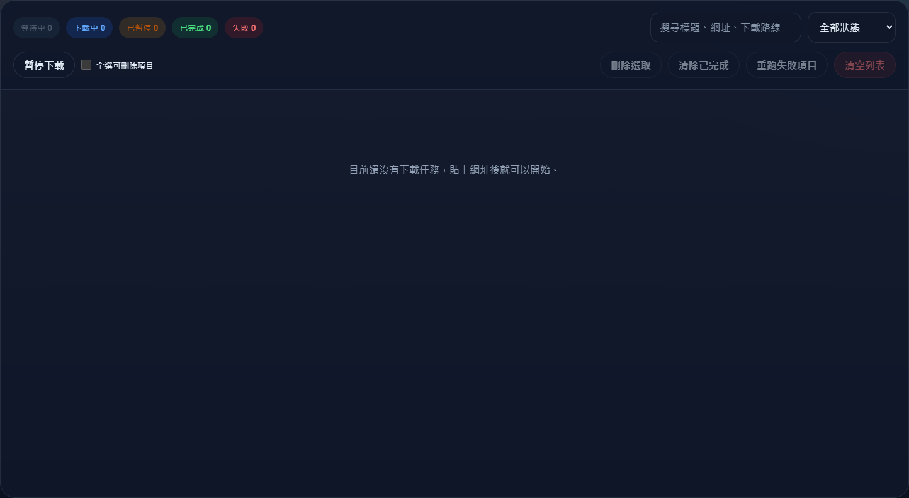

# Multi-Platform Downloader

跨平台影音、音訊、字幕下載桌面工具。  
目前以 `Electron + React + Vite + TypeScript` 製作，核心下載能力以 `yt-dlp` 為主，並針對 `Douyin / Skool` 這類比較麻煩的平台補上專用擷取路線。

## 特色

- 支援多平台網址貼上與佇列下載
- 支援影片 / 音訊模式、清晰度、字幕、自動字幕、SRT 轉換
- 支援播放清單與區間下載
- 支援 `cookies.txt` 與瀏覽器 cookies
- 支援下載列表搜尋、狀態篩選、批次刪除、重跑失敗項目
- 支援 Douyin 作者頁 / 搜尋頁批次收集

## 目前支援的平台

- YouTube / Shorts / Playlist
- TikTok
- Douyin
- Instagram Reels / 貼文影片
- Skool
- 其他 `yt-dlp` 可處理的平台

> 平台規則常常改，這種事比天氣還難預測。  
> 所以目前架構是「能專用就專用，不能專用就 fallback 到 `yt-dlp`」。

## 介面截圖

### 主畫面



### 下載列表



## 快速開始

### 方式一：直接使用 Windows 打包版

1. 開啟 `release/win-unpacked/ai_yd-dlp.exe`
2. 貼上網址
3. 選擇輸出資料夾
4. 按右上角 `加入下載`

如果你要用安裝版：

- `release/ai_yd-dlp Setup 0.0.1.exe`

### 方式二：從原始碼開發

#### 1. 安裝環境

- Node.js 20+
- `yt-dlp`
- `ffmpeg`

請先確認這兩個指令有在 PATH：

```bash
yt-dlp --version
ffmpeg -version
```

#### 2. 安裝套件

```bash
npm install
```

#### 3. 啟動開發模式

```bash
npm run dev
```

#### 4. 建置

```bash
npm run build
```

#### 5. 打包 Windows 版本

```bash
npm run dist:win
```

打包完成後會在：

- `release/win-unpacked/ai_yd-dlp.exe`
- `release/ai_yd-dlp Setup 0.0.1.exe`

## 使用教學

### 1. 一般影片下載

1. 把網址貼到左側 `網址`
2. 選擇 `輸出資料夾`
3. 按 `加入下載`
4. 任務會進入右側列表，依序下載

### 2. 只下載音訊

1. 展開 `進階設定`
2. 將 `下載模式` 改成 `音訊`
3. 選擇音質
4. 加入下載

### 3. 下載字幕

1. 展開 `進階設定`
2. 勾選 `下載字幕`
3. 如果需要自動字幕，再勾 `下載自動字幕`
4. 如果想轉成 `srt`，勾選 `轉成 SRT`

### 4. 下載播放清單

1. 展開 `進階設定`
2. 勾選 `下載播放清單`
3. 貼上播放清單網址
4. 加入下載

### 5. 下載指定區間

1. 展開 `進階設定`
2. 勾選 `下載指定區間`
3. 填入開始時間與結束時間
4. 時間格式使用 `HH:MM:SS`

### 6. Douyin 作者頁 / 搜尋頁批次下載

1. 切到 `抖音` 分頁
2. 貼上作者頁、搜尋頁或列表頁網址
3. 按 `加入下載`
4. 程式會打開 Douyin 視窗
5. 往下滑到你想收集的作品數量
6. 按右下角 `完成收集並開始下載`

### 7. 重跑失敗項目

如果某些任務失敗：

1. 看右側工具列的 `失敗` 計數
2. 直接按 `重跑失敗項目`
3. 所有失敗任務會重新排進佇列

## 平台注意事項

### Douyin

- 程式會先走頁面直讀
- 抓不到實際媒體時，會改走瀏覽器擷取
- 仍不行才 fallback 到 `yt-dlp`
- 內建會攔掉 `bytedance://` 這類外部 deep link

### Skool

- 有些內容需要登入
- 如果直連抓不到，會走瀏覽器擷取串流
- 建議搭配 cookies 或已登入 session

## 下載列表功能

- 暫停下載 / 繼續下載
- 單筆任務暫停 / 繼續 / 取消
- 刪除選取
- 清除已完成
- 清空列表
- 詳情展開
- 右鍵操作：重新下載 / 開啟資料夾 / 複製網址

## 專案結構

```text
.
├─ build/                 # icon 與打包資產
├─ docs/                  # PRD / 架構 / 指令對照 / 截圖
├─ electron/              # main process / preload / worker
├─ scripts/               # 打包與輔助腳本
├─ shared/                # 共用型別與工具
├─ src/                   # renderer UI 與測試
├─ AGENTS.md              # Codex / AI Agent 專案規則
└─ README.md
```

## GitHub 上傳教學

這個專案本機已經可以接到你的 GitHub repo：

- `git@github.com:Forty-s-AI-Company/Multi-Platform-Downloader.git`

### 如果你是第一次推上去

```bash
git add .
git commit -m "Initial project setup"
git push -u origin main
```

### 如果你之後要更新

```bash
git add .
git commit -m "Update downloader features"
git push
```

### 確認 remote

```bash
git remote -v
```

## 開發文件

- `AGENTS.md`
- `docs/PRD.md`
- `docs/ARCHITECTURE.md`
- `docs/CLI_MAPPING.md`
- `docs/PLATFORM_SUPPORT.md`

## License

目前未附授權條款；如果之後要公開協作，建議補上 `MIT` 或你自己的商業授權說明。
